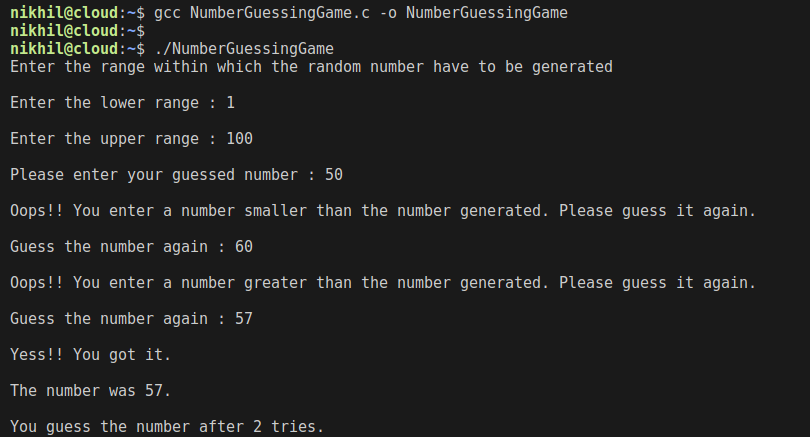

# NumberGuessingGame

Developed a very basic command line Game in C programming language. I developed it just to revise my basic C concepts. 
This program makes use of basic C conditional statements like ```if-else``` and looping statements like ```while```, ```do-while``` or ```for``` loop, It also makes use of a random number generator function ```rand()``` which will generate any random number within the range provided by the user.

The user will be asked to enter the range of the numbers from which the random number have to be generated and then he/she will guess the number. At last, the program will display how many tries are taken by the user to guess that random number.

**To compile a C program:**
```c
gcc NumberGuessingGame.c -o NumberGuessingGame
```

**To execute the program:**
```c
./NumberGuessingGame
```


**Here is the example of the Output:**


